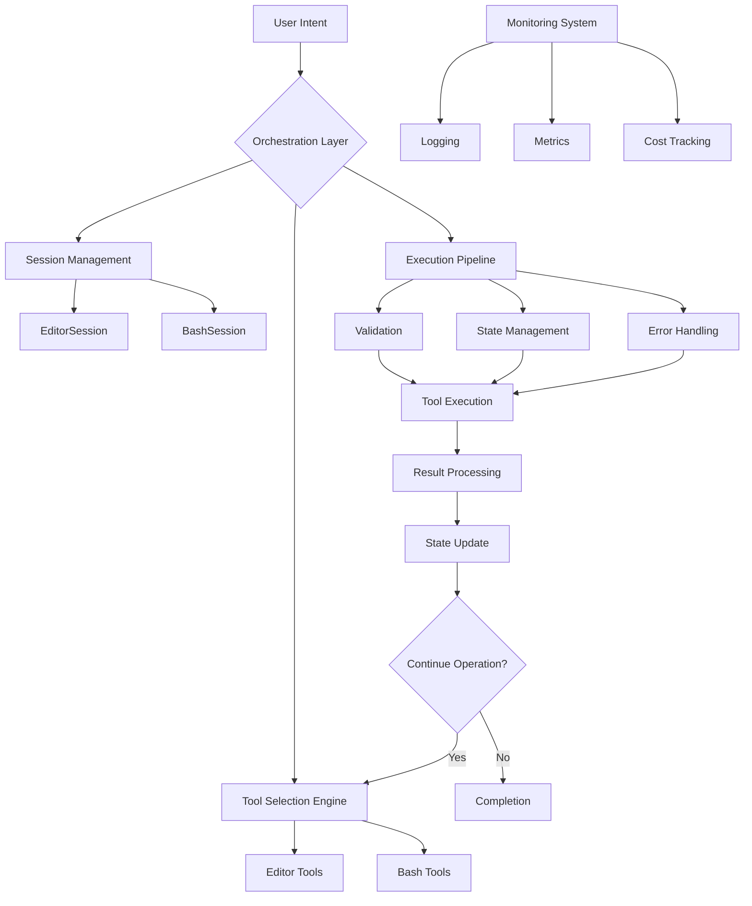

# Anthropic Computer Use POC -> Tool Orchestration & Automation
> An intelligent orchestration layer powered by Claude 3.5 Sonnet that coordinates file operations and terminal commands.
> 
> Advanced proof of concept demonstrating autonomous tool coordination and execution.
> Fork and start building your next-gen Developer Experience (DevX) platform.
>
> 🚀 Watch the walk through [video here](https://youtu.be/FxwA0DLxyrw).

## 📌 Key Orchestration Features
> **Core Innovation: Intelligent Tool Orchestration** - Claude acts as an autonomous coordinator and delegator, orchestrating complex workflows through tool composition while maintaining context and managing state across multiple tools and sessions.

### The Orchestrator Agent
The orchestrator agent serves as the central intelligence that:
- Analyzes user intent and breaks down complex requests into actionable steps
- Intelligently delegates tasks to appropriate specialized tools
- Maintains context and state across multiple tool interactions
- Handles cross-tool data transfer and format conversions
- Manages error recovery and alternative execution paths
- Optimizes tool usage based on past interactions
- Provides explanatory feedback and progress updates

### Tool Composition & Orchestration
- Dynamic orchestration of tools based on natural language intent:
  - Autonomous tool selection and sequencing
  - Context-aware decision making
  - Multi-step workflow planning and execution
  - Error handling and recovery

### Available Tools & Capabilities
- **Editor Orchestration Suite**:
  - Five core operations: `view`, `create`, `str_replace`, `insert`, `undo_edit`
  - Stateful file manipulation
  - Atomic operations with rollback support
  - Context-aware text transformations

- **Terminal Command Orchestration**:
  - Secure command execution
  - Output processing and state management
  - Command chaining and pipeline creation
  - Safe mode operations (`--no-agi`)

- **Database Session (DBSession)**:
  - SQLite database operations and queries 
  - Data creation, retrieval, and manipulation
  - Table management and schema operations
  - Query result processing and state persistence
  - Automated schema inference and validation
  - Transaction management and rollback support
  - Query optimization and performance monitoring
  - Integration with file operations for data import/export

- **Mermaid Session (MermaidSession)**:
  - Generation and manipulation of Mermaid diagrams
  - Support for multiple diagram types (flowcharts, sequences, class diagrams, etc.)
  - Real-time diagram updates and modifications
  - Integration with markdown documentation
  - Smart diagram layout optimization
  - Automatic node and relationship management
  - Style customization and theming
  - Bi-directional conversion between diagram types
  - Version control and diagram history tracking

### Orchestration Intelligence
- Claude analyzes intent and automatically:
  - Plans multi-step tool sequences
  - Maintains context across operations
  - Validates operations before execution
  - Provides intelligent error recovery
  - Optimizes tool usage patterns

### Monitoring & Observability
- Comprehensive logging system tracks:
  - Tool selection decisions
  - Operation sequences
  - State changes
  - Performance metrics
  - Token usage and costs

## ⚙️ Setup
- `brew install uv` or [install another way](https://docs.astral.sh/uv/getting-started/installation/#pypi).
- `uv sync`
- `cp .env.sample .env` and set your ANTHROPIC_API_KEY
- (text mode) `uv run main "hi please create a file called 'ping.txt' and write 'pong' in it."`
  - This will create a file at `./editor_dir/ping.txt` with the text `pong`.
- (bash mode) `uv run main "show me the contents of the current directory" --mode bash`

## 🚀 Usage

### Editor Tool Usage
- Create and edit files with natural language:
  - `uv run main "hi please create a file called 'ping.txt' and write 'pong' in it."`
  - `uv run main "update the config.json file to add a new logging section" --mode editor`
  - `uv run main "create a new Python script that implements a basic web server" --mode editor`

### Bash Tool Usage  
- Execute shell commands through Claude:
  - `uv run main "show me the contents of the current directory" --mode bash`
  - `uv run main "show me the contents of the current directory" --mode bash--no-agi` (safe mode)
  - `uv run main "list tables from the data/app.db file" --mode bash`
  - `uv run main "read the first 3 lines of README.md and write insert them into the data/app.db sqlite database logging table" --mode bash` 

### Database Tool Usage
- Interact with SQLite databases:
  - Basic Operations:
    - `uv run main "create a new table called users with columns for id, name, and email"`
    - `uv run main "insert sample user data into the users table"`
    - `uv run main "query all users and format the output as a markdown table"`
  - Advanced Operations:
    - `uv run main "create a view that shows user activity metrics"`
    - `uv run main "set up a trigger to update the last_modified timestamp"`
    - `uv run main "create an index on frequently queried columns"`
  - Data Integration:
    - `uv run main "export query results to a CSV file"`
    - `uv run main "import JSON data from api_response.json into the users table"`
    - `uv run main "analyze table statistics and generate a report"`

### Mermaid Diagram Tool Usage
- Create and modify Mermaid diagrams:
  - Flowchart Operations:
    - `uv run main "create a flowchart diagram showing the user authentication process"`
    - `uv run main "update the diagram to add error handling paths"`
    - `uv run main "optimize the flowchart layout to minimize crossing lines"`
  - Multi-diagram Operations:
    - `uv run main "convert the flowchart to a sequence diagram"`
    - `uv run main "create a class diagram from the database schema"`
    - `uv run main "generate an entity relationship diagram from tables"`
  - Advanced Features:
    - `uv run main "add click events to diagram nodes for interactivity"`
    - `uv run main "apply a custom theme to the diagram"`
    - `uv run main "create subgraphs to group related processes"`

## 🌟 Very cool command sequence
- `uv run main "write a detailed 3 use case document for llms to a 'llm_use_cases.md' markdown file. then break that file into three going into details about the use cases."`
  - This will create a file at `./repo/llm_use_cases.md` with the 3 use cases.
  - Then it will break that file into three going into details about the use cases.
- `uv run main "update the llm_use_cases.md file to add a fourth use case for data analysis and insights."`
- `uv run main "read the llm_use_cases.md file and update it to contain a mermaid diagram of the use cases."`
- `uv run main "update llm_use_cases.md: simplify the mermaid chart and make it lr."`

## 🔄 Orchestration Architecture & Workflow

### Orchestration Components

1. **Intent Analysis Layer**
   - Processes natural language instructions
   - Determines operation scope and requirements
   - Plans execution strategy

2. **Session Management**
   - Maintains stateful operations
   - Handles context switching
   - Manages resource allocation

3. **Tool Selection Engine**
   - Intelligent tool composition
   - Operation sequencing
   - Dependency resolution
   - Command optimization

4. **Execution Pipeline**
   - Pre-execution validation
   - State management
   - Error handling and recovery
   - Result processing

5. **Monitoring & Analytics**
   - Comprehensive logging
   - Performance metrics
   - Cost tracking
   - Operation analytics

### Operation Flow

1. User provides high-level intent via natural language
2. Orchestration layer analyzes and decomposes the request
3. Tool selection engine creates execution plan
4. Validation system checks operation safety
5. Tools execute in optimized sequence
6. Results are processed and state is updated
7. System determines if further operations needed
8. Monitoring system tracks entire process

## 📚 Resources                                                                                                                   
                                                                                                                              
- https://docs.anthropic.com/en/docs/build-with-claude/computer-use                                                            
- https://github.com/anthropics/anthropic-quickstarts/blob/main/computer-use-demo/computer_use_demo/loop.py   
